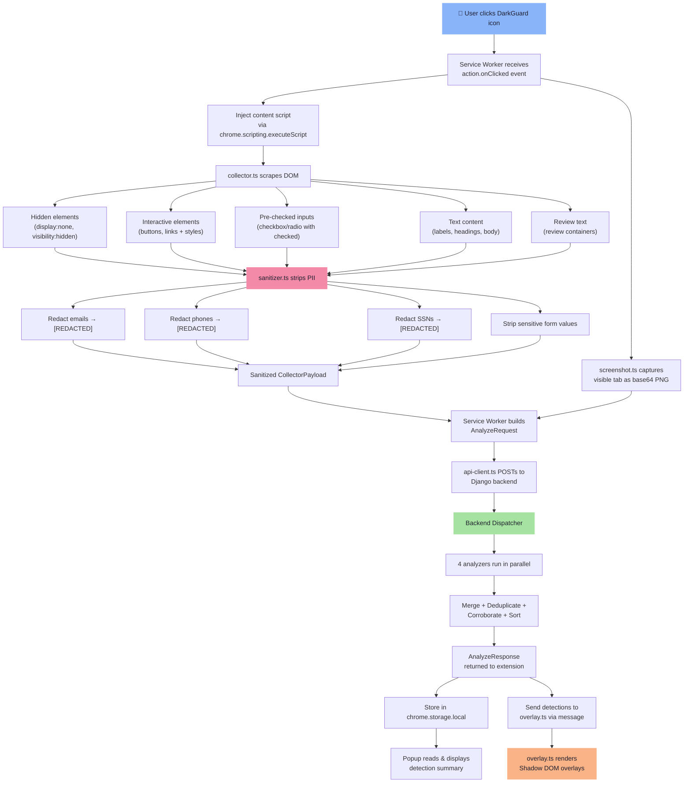
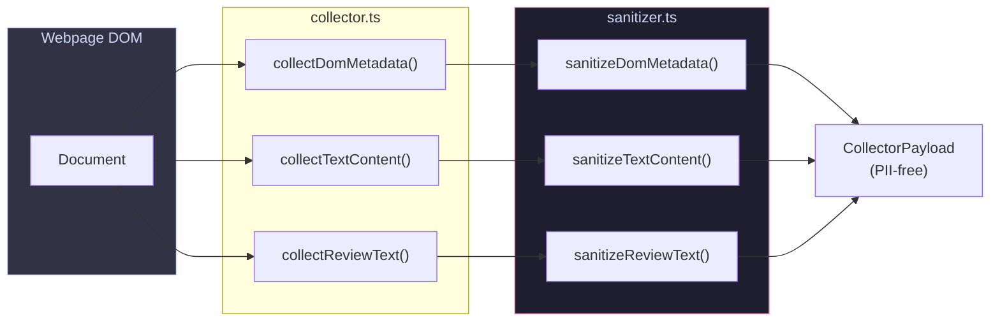
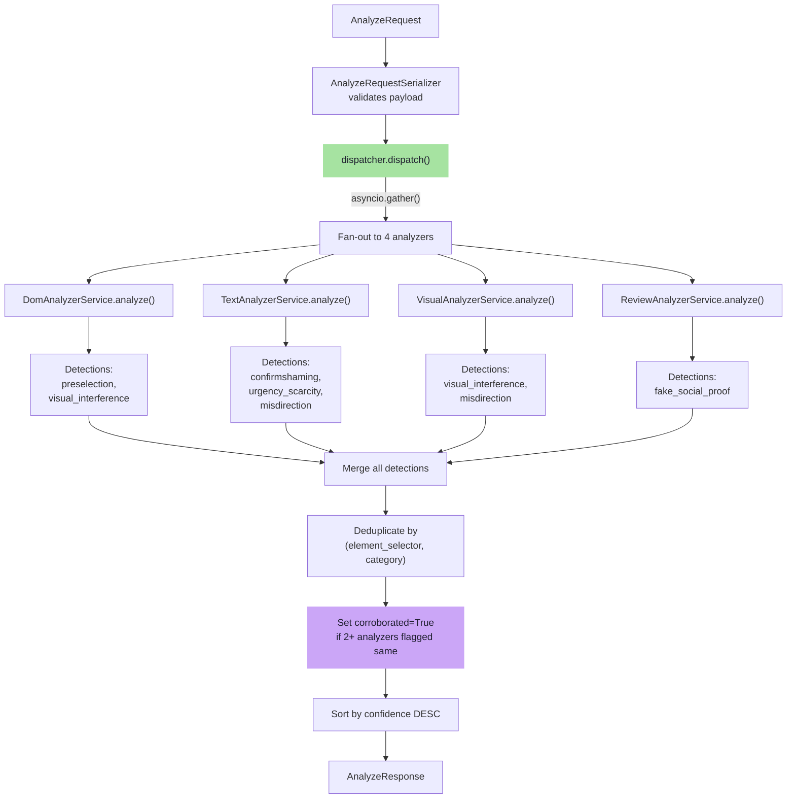
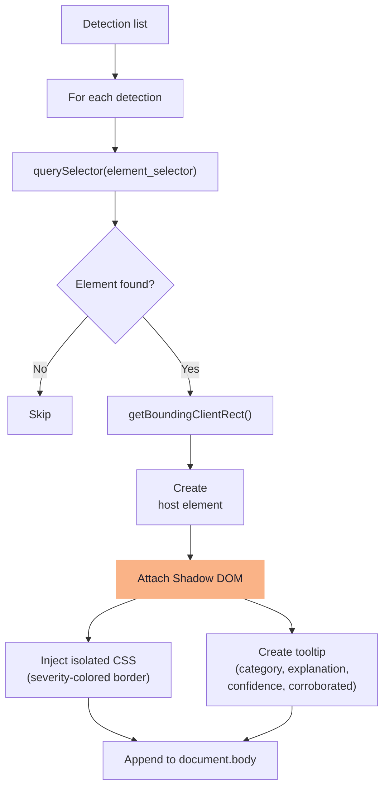

# Data Flow

> End-to-end walkthrough of how data moves through DarkGuard, from user click to overlay rendering.

## Complete Pipeline



## Phase 1: Signal Collection (Browser-Side)



### What Gets Collected

| Field | Source | Content |
|---|---|---|
| `dom_metadata.hidden_elements` | `querySelectorAll('[style*="display:none"], [hidden], .hidden')` | Selector, tag, text, styles |
| `dom_metadata.interactive_elements` | `querySelectorAll('button, a, [role="button"], input[type="submit"]')` | Selector, tag, text, bounding rect, computed styles |
| `dom_metadata.prechecked_inputs` | `querySelectorAll('input[checked]')` | Selector, tag, attributes |
| `text_content.button_labels` | All interactive elements | `{selector, text}` pairs |
| `text_content.headings` | `querySelectorAll('h1, h2, h3, h4, h5, h6')` | `{selector, text}` pairs |
| `text_content.body_text` | `document.body.innerText` (truncated) | First 5000 chars |
| `review_text` | `querySelectorAll('[itemprop="reviewBody"], .review-text')` | Concatenated review bodies |

## Phase 2: Backend Analysis



## Phase 3: Overlay Rendering



### Overlay Color Coding

| Severity | Border Color | Hex |
|---|---|---|
| 🔴 High | Red | `#f38ba8` |
| 🟠 Medium | Orange | `#fab387` |
| 🔵 Low | Blue | `#89b4fa` |

## Data Shape Reference

### AnalyzeRequest (Extension → Backend)

```json
{
  "url": "https://example.com/product",
  "dom_metadata": {
    "hidden_elements": [...],
    "interactive_elements": [...],
    "prechecked_inputs": [...]
  },
  "text_content": {
    "button_labels": [{"selector": "#btn", "text": "Buy Now"}],
    "headings": [{"selector": "h1", "text": "Flash Sale!"}],
    "body_text": "Only 3 left in stock..."
  },
  "screenshot_b64": "data:image/png;base64,...",
  "review_text": "Amazing product!---Great item!---Must buy!"
}
```

### AnalyzeResponse (Backend → Extension)

```json
{
  "detections": [
    {
      "category": "urgency_scarcity",
      "element_selector": "body",
      "confidence": 0.85,
      "explanation": "Urgency language detected: \"Only 3 left in stock\"",
      "severity": "medium",
      "corroborated": false,
      "user_feedback": null
    }
  ]
}
```
